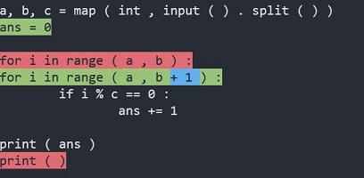

# differ-for-code

The library is optimized for extracting difference between source code.

Note: This library is assumed to be used after tokenization. The input format should be `List[List[str]]` that represents "a list of tokens for each line".

## Example

See the code [sample.py](sample.py)

`before.py`
```py
a, b, c = map ( int , input ( ) . split ( ) )

for i in range ( a , b ) :
    if i % c == 0 :
        ans += 1

print ( ans )
print ( )

```

`after.py`
```py
a, b, c = map ( int , input ( ) . split ( ) )
ans = 0

for i in range ( a , b + 1 ) :
    if i % c == 0 :
        ans += 1

print ( ans )

```



result
```
[equal]
    [before: 0]
        a, b, c = map ( int , input ( ) . split ( ) )
    [after: 0]
        a, b, c = map ( int , input ( ) . split ( ) )
[insert]
    [before: 1]
        None
    [after: 1]
        ans = 0
[equal]
    [before: 1]

    [after: 2]

[line_replace]
    [before: 2]
        [(equal, 'for', 'for', 0:3, 0:3), (equal, ' ', ' ', 3:4, 3:4), (equal, 'i', 'i', 4:5, 4:5), (equal, ' ', ' ', 5:6, 5:6), (equal, 'in', 'in', 6:8, 6:8), (equal, ' ', ' ', 8:9, 8:9), (equal, 'range', 'range', 9:14, 9:14), (equal, ' ', ' ', 14:15, 14:15), (equal, '(', '(', 15:16, 15:16), (equal, ' ', ' ', 16:17, 16:17), (equal, 'a', 'a', 17:18, 17:18), (equal, ' ', ' ', 18:19, 18:19), (equal, ',', ',', 19:20, 19:20), (equal, ' ', ' ', 20:21, 20:21), (equal, 'b', 'b', 21:22, 21:22), (equal, ' ', ' ', 22:23, 22:23), (equal, ')', ')', 23:24, 23:24), (equal, ' ', ' ', 24:25, 24:25), (equal, ':', ':', 25:26, 25:26)]
    [after: 3]
        [(equal, 'for', 'for', 0:3, 0:3), (equal, ' ', ' ', 3:4, 3:4), (equal, 'i', 'i', 4:5, 4:5), (equal, ' ', ' ', 5:6, 5:6), (equal, 'in', 'in', 6:8, 6:8), (equal, ' ', ' ', 8:9, 8:9), (equal, 'range', 'range', 9:14, 9:14), (equal, ' ', ' ', 14:15, 14:15), (equal, '(', '(', 15:16, 15:16), (equal, ' ', ' ', 16:17, 16:17), (equal, 'a', 'a', 17:18, 17:18), (equal, ' ', ' ', 18:19, 18:19), (equal, ',', ',', 19:20, 19:20), (equal, ' ', ' ', 20:21, 20:21), (equal, 'b', 'b', 21:22, 21:22), (equal, ' ', ' ', 22:23, 22:23), (insert, None, '+', 23:23, 23:24), (insert, None, ' ', 23:23, 24:25), (insert, None, '1', 23:23, 25:26), (insert, None, ' ', 23:23, 26:27), (equal, ')', ')', 23:24, 27:28), (equal, ' ', ' ', 24:25, 28:29), (equal, ':', ':', 25:26, 29:30)]
[equal]
    [before: 3]
                if i % c == 0 :
    [after: 4]
                if i % c == 0 :
[equal]
    [before: 4]
                        ans += 1
    [after: 5]
                        ans += 1
[equal]
    [before: 5]

    [after: 6]

[equal]
    [before: 6]
        print ( ans )
    [after: 7]
        print ( ans )
[delete]
    [before: 7]
        print ( )
    [after: 8]
        None
[equal]
    [before: 8]

    [after: 8]
```
